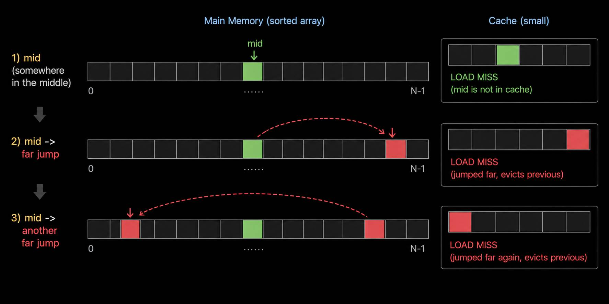

# Java Quad Search – A Faster Alternative to Binary Search
An SIMD-powered search algorithm in Java that beats binary search for larger arrays.

Inspired by Lemire's blog post: https://lemire.me/blog/2026/04/27/you-can-beat-the-binary-search/

Thanks to Daniel Lemire for this interesting idea.

## Motivation
Binary search is theoretically optimal. Its runtime complexity is `O(log n)`. What it means by example: 
- Minimal comparisons, only 30 operations for 1 billion entries.

So, we can think of this; is there still any room for improvement? Probably, yes. Because:
- Modern CPUs are not comparison-bound anymore.
- Memory hierarchy and branch prediction dominate performance.

In this experiment, we take `Arrays.binarySearch` in Java as reference. We tried two alternative implementations:
1. `QuadSearch`: Quaternary narrowing – predefined blocks are grouped into four regions until max. 3 blocks left and then continue with normal sequential search
2. `SIMDQuadSearch`: Quaternary narrowing – the same process above – and then SIMD powered sequential search 

In both implementations, we keep the `Arrays.binarySearch` semantics the same:
- If the search value is found, we return the index which could be `[0, n) when array size is n` 
- If the search value is not found, we return the insertion point as `(-insertion-point - 1)`

## Benchmark
In the benchmarks, we use different sizes of arrays; 4k, 8k, 16k, 32k, 64k, 128k, 256k, 512k, and 1m (from 2^12 to 2^20 — 4096 to 1,048,576) 

In our randomly generated test data, the count of arrays decreases proportionally while the size increases, like in the pattern below:
```
| Count | Array Size |
|-------|------------|
| 256k  | 4k         |
| 128k  | 8k         |
| 64k   | 16k        |
| 32k   | 32k        |
| 16k   | 64k        |
| 8k    | 128k       |
| 4k    | 256k       |
| 2k    | 512k       |
| 1k    | 1m         |
```
We took this approach because it is aligned with the real world use-cases. Usually, you have many but small-sized arrays, like in Vector databases, or you have few but larger arrays, such as per-column sorted data structures in OLAP/columnar databases and large inverted index posting lists in search engines.

Additionally, we run two different benchmarks to test cold and warm cache behavour:
1. Cold cache behavour: Search an array once, continue with the next one
2. Warm cache behavour: Search an array 100 times before going on with the next one

All the benchmarks we run in the latest Java 25 version (by the time released in [sdkman](https://sdkman.io/)) on both Oracle JDK and GraalVM vendors.

## TL;DR: Main Observation
A cache-friendly hybrid **quaternary search with SIMD instructions** can outperform `Arrays.binarySearch` by:
- up to **25%** on Oracle JDK, up to **16%** on GraalVM on Apple M4 ARM64 (Neon 128-bit) hardware
- up to **24%** on Oracle JDK, up to **29%** on GraalVM on x86-64 AMD (AVX2 256-bit) hardware
- **p99** values are better than default binary search almost in all test cases

You can check the results in here: [charts](https://java-fast.github.io/quad-search/)

Alternatively, the JMH results you can see over here: [docs/results/](docs/results/)  

## Why Classic Binary Search is not Hardware-Friendly

### Binary Search Access Pattern
To understand better why Binary Search is not Hardware-Friendly, let's have a look at Binary search's access pattern. Binary search works fundemantally based on accessing mid-points which consequently leads to:
- random memory jumps
- poor cache locality
- difficult branch prediction



As we notice, each access jumps to a distant location, so very little (or none) of the data stays in the cache.

Therefore, cache locality is almost never preserved.

### Theory vs Real Hardware
In theory, binary search is very optimal that makes fewer comparisons all the time. Considering an array of 1 billion entries, it's still only **30** operations (2^30 = 1,073,741,824 ~= 1B) to scan the entire array. 

However, fewer comparisons do not necessarily mean lower latency. Modern CPUs prefer:
- sequential memory access
- predictable control flow
- cache locality

over minimal comparison count.

## Why Small Linear Scans Are Surprisingly Fast

### Locality Wins
In modern CPUs scanning 16–32 contiguous integers is extremely cache-friendly. There are many advantages of contiguous traversal, like:
- sequential loads
- hardware prefetch efficiency
- minimal branch entropy
- high Out-of-Order utilization

Thus, sometimes a tiny linear scan can surprisingly outperform logarithmic search locally.

## The Hybrid Quaternary Search Design

### Core Idea
We split the search into two phases:
1. Quaternary narrowing
2. Local block scan (via SIMD)

Architecture:
```
Large array
↓
Quaternary narrowing
↓
1 to 3 small blocks remain
↓
Linear block scan with SIMD
```
### Quaternary Narrowing
Quaternary narrowing reduces the search space by probing three evenly distributed pivot points instead of a single midpoint as in classic binary search. On each iteration, the algorithm divides the remaining range into four regions and quickly narrows the candidate space down to one quarter of its previous size. 

Once only one to three small blocks remain, the search switches to a localized linear or SIMD-assisted scan. This hybrid approach trades a few additional comparisons for significantly better cache locality, more predictable memory access patterns, and reduced branch entropy on modern CPUs.

### Implementing SIMD algorithms in Java
In Java by using Project Panama's [Vector API](https://openjdk.org/jeps/426), we can tell the compiler to use vector instructions and get the performance benefit of SIMD on supported CPU architectures. Thus, we can read and compare more than 8 bytes, like 16 or 32 bytes depending on the underlying hardware.

Hence, the last remaining blocks (max. three blocks each has a size of 16) can be read by using Vector API:
```java
/**
 * Search inside one 16-element block.
 * <p>
 * Returns:
 * found index
 * OR -(insertionPoint + 1)
 */
private static int blockSearch(int[] array, int base, int target) {
    final int step = SPECIES.length();
    for (int offset = 0; offset < BLOCK_SIZE; offset += step) {
        final int indexBase = base + offset;
        final IntVector values = IntVector.fromArray(SPECIES, array, indexBase);

        final VectorMask<Integer> geMask = values.compare(VectorOperators.GE, target);
        final long bits = geMask.toLong();

        if (bits != 0) {
            final int lane = Long.numberOfTrailingZeros(bits);
            final int index = indexBase + lane;
            final int value = array[index];

            return (value == target) ? index : -(index + 1);
        }
    }

    return -((base + BLOCK_SIZE) + 1);
}
```
